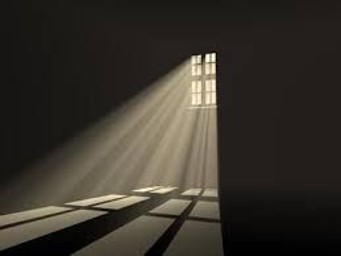
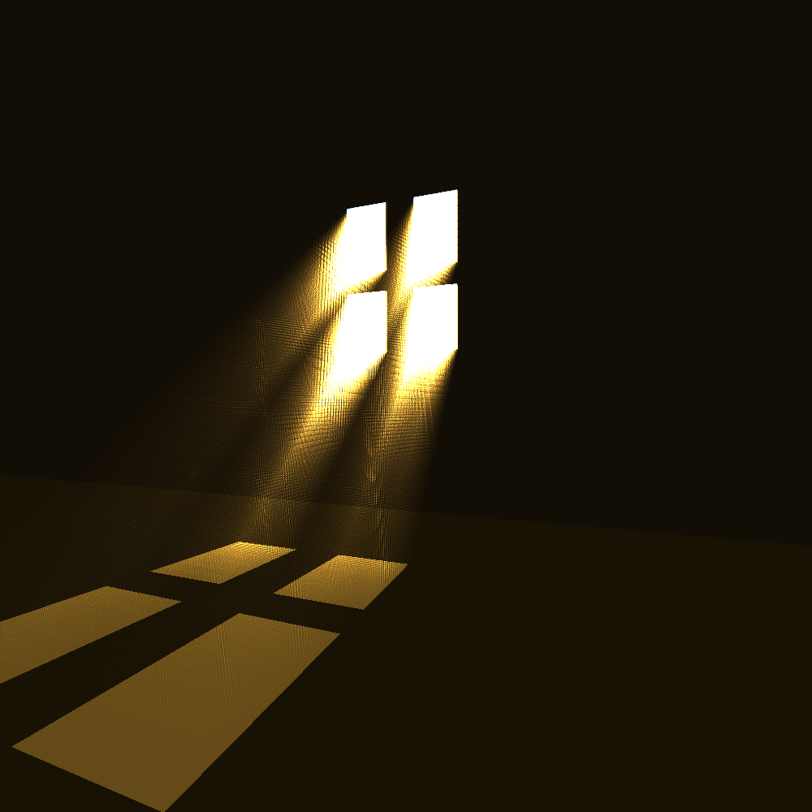
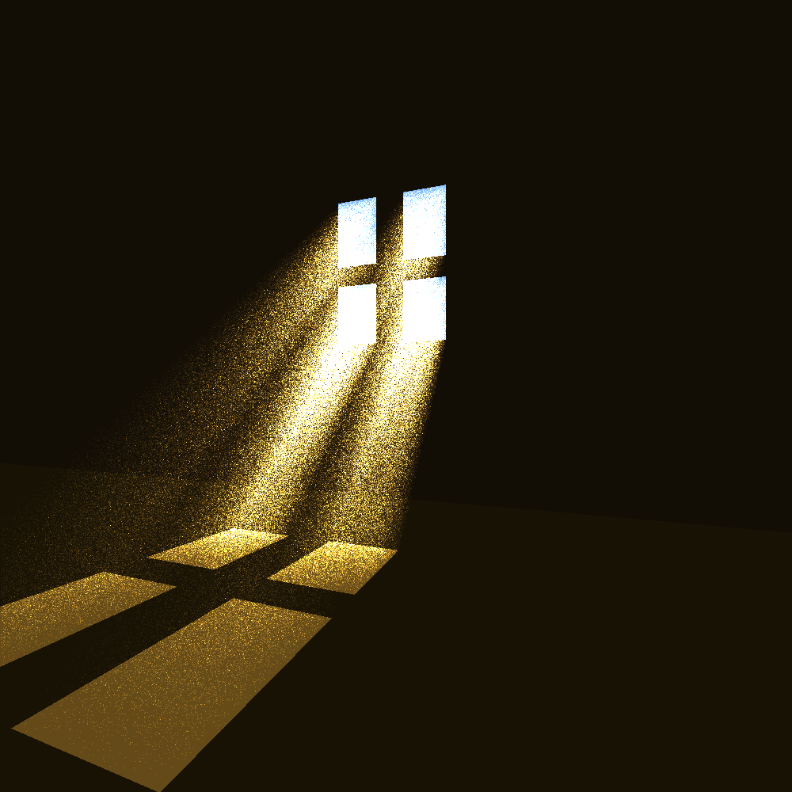

# Tyndall Effect

The basic objective of this project is to use the techniques taught while making a 
ray tracer to simulate the “Tyndall Effect” that occurs from the scattering of light 
due to particles in its medium. A scene with a foggy/dusty room with a window for 
light source will be generated to display the Tyndall effect.

The primary objective was to recreate the following image:

## Approach

The approach taken to accomplish this is to implement Ray marching over the ray 
tracing method. The ray tracer is used to recreate the silhouette 
of the window on the floor. Then Ray marching is used to generate the God rays from 
a point light source through the window.

The basic method involved in Ray marching is to cast rays from the light source to the 
floor and to track points on the ray at equal intervals. Each point on the ray holds a 
certain energy factor which becomes less when it is further away from the light 
source. Then we check if those points are visible in the view frame and if it is, then we 
map the point coordinates to the coordinates of the pixel, and scale its color with the 
energy factor of the ray point.

This step is repeated for multiple rays being casted through the window to the scene. 
This method is further developed by using a random function to generate points at 
random locations on the ray, instead of a uniform distribution. The aim is to give the 
medium of the light rays a more foggy / dusty feel.

The variables used to control the god rays are: 
 * Steps
 * delta
 * enhance
 * Method

These 4 global variables that can be edited at the top of the Tracer2.java file. ‘Steps’ 
will change the number of points used per Ray. ‘delta’ will change the distance 
between the points in the ray (intensity increases when points are closer) ‘enhance’ 
will affect the factor by which the pixel color is scaled ‘Method’ is either a 0 or 1 
value: 
* 0 -> equidistant ray marching method 
* 1 -> randomized ray marching method

## Results

Ray marching without randomness:

Ray marching with randomness:

